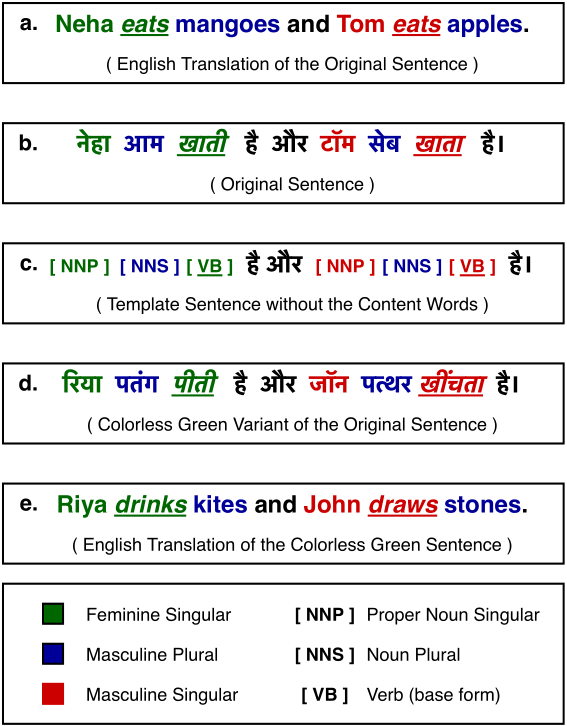
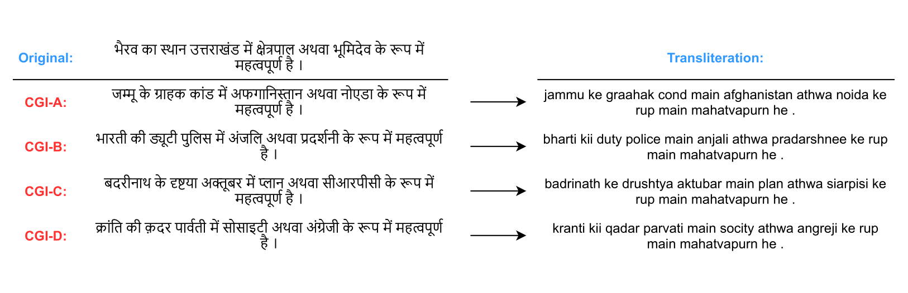

# Vyākarana

<p align="center">
  
&nbsp; &nbsp; &nbsp; &nbsp;
  
</p>

While there has been significant progress towards developing NLU resources for Indic languages, syntactic evaluation has been relatively less explored. Unlike English, Indic languages have rich morphosyntax, grammatical genders, free linear word-order, and highly inflectional morphology. Here, we introduce **Vyākarana**: a benchmark of Colorless Green sentences in Indic languages for syntactic evaluation of multilingual language models.

The benchmark comprises four syntax-related tasks:
1. PoS Tagging (`POS`)
2. Grammatical Case Marking (`GCM`)
3. Syntax Tree-depth Prediction (`STDP`)
4. Subject-Verb Agreement (`SVA`).

## Probing Leaderboard

### Hindi

|  **Treebank** | **Probing Task** | **Last Layer** |           |                 |               |           | **Best Layer** |             |                 |               |             |
|:-------------:|:----------------:|:--------------:|:---------:|:---------------:|:-------------:|:---------:|:--------------:|:-----------:|:---------------:|:-------------:|:-----------:|
|               |                  |    **[mBERT](https://huggingface.co/bert-base-multilingual-cased)**   | **[XLM-R](https://huggingface.co/xlm-roberta-base)** | **[DistilmBERT](https://huggingface.co/distilbert-base-multilingual-cased)** | **[IndicBERT](https://huggingface.co/ai4bharat/indic-bert)** | **[MuRIL](https://huggingface.co/google/muril-base-cased)** |    **[mBERT](https://huggingface.co/bert-base-multilingual-cased)**   |  **[XLM-R](https://huggingface.co/xlm-roberta-base)**  | **[DistilmBERT](https://huggingface.co/distilbert-base-multilingual-cased)** | **[IndicBERT](https://huggingface.co/ai4bharat/indic-bert)** |  **[MuRIL](https://huggingface.co/google/muril-base-cased)**  |
|  **[CG-HDTB](https://github.com/rajaswa/indic-syntax-evaluation/tree/main/treebanks/hindi/CG-HDTB)**  |      **POS**     |     0.8894     |   **0.9143**  |      0.8448     |     0.7418    |   0.6807  |   0.8932 (11)  |  **0.9232 (8)** |    0.8543 (5)   |   0.7642 (6)  |  0.7030 (2) |
|               |     **STDP**     |     0.3455     |   0.2138  |      0.3254     |     **0.3566**    |   0.2318  |    0.3730 (6)   |  0.3232 (3) |    **0.3881 (5)**   |   0.3756 (4)  |  0.3570 (10) |
|               |      **GCM**     |     0.6886     |   **0.6967**  |      0.6733     |     0.6216    |   0.5463  |    0.7050 (7)   |  **0.7234 (8)** |    0.6968 (4)   |   0.6479 (2)  |  0.5878 (3) |
|               |      **SVA**     |     0.6003     |   0.5935  |      **0.6040**      |     0.3990     |   0.5568  |   **0.6140 (8)**   | 0.5935 (12) |    0.6040 (6)    |   0.4451 (2)  | 0.5568 (12) |
|               |    **Average**   |     **0.6310**    |  0.6046 |     0.6119    |    0.5298    |   0.5039  |     **0.6463**     |   0.6408  |      0.6358     |     0.5582    |   0.5511   |
| **[csCG-HDTB](https://github.com/rajaswa/indic-syntax-evaluation/tree/main/treebanks/hindi/csCG-HDTB)** |      **POS**     |     0.7543     |   **0.7881**  |      0.7422     |     0.7303    |   0.6752  |     0.7744 (7)    |    **0.8079 (10)**  |      0.7596 (5)    |     0.7608 (2)   |    0.7011 (1)   |
|               |     **STDP**     |     0.3104     |   0.3429  |      0.3531     |     **0.3805**    |   0.2457  |     0.3879 (7)    |    0.3584 (3)  |      0.3843  (5)   |     **0.3909  (3)**  |    0.3676 (7)  |
|               |      **GCM**     |     0.6415     |   0.6456  |      **0.6533**     |     0.6306    |   0.5653  |     0.6604 (8)    |   **0.6683 (8)**  |      0.6549 (5)    |     0.6535  (8)  |    0.5859  (3) |
|               |      **SVA**     |     0.5334     |   **0.5629**  |      0.5255     |     0.5389    |   0.5262  |      0.5650 (1)    |    0.5629 (12)  |      **0.5752  (3)**   |     0.5389  (12)  |    0.5647  (11) |
|               |    **Average**   |     0.5599     |  **0.5849** |     0.5685    |    0.5701   |   0.5031  |    0.5969    |   **0.5994**  |      0.5935     |    0.5860   |   0.5548  |

### Tamil

| **Treebank** | **Probing Task** | **Last Layer** |              |                 |               |              | **Best Layer** |              |                 |               |              |
|:------------:|:----------------:|:--------------:|:------------:|:---------------:|:-------------:|:------------:|:--------------:|:------------:|:---------------:|:-------------:|:------------:|
|              |                  |    **[mBERT](https://huggingface.co/bert-base-multilingual-cased)**   |   **[XLM-R](https://huggingface.co/xlm-roberta-base)**  | **[DistilmBERT](https://huggingface.co/distilbert-base-multilingual-cased)** | **[IndicBERT](https://huggingface.co/ai4bharat/indic-bert)** |   **[MuRIL](https://huggingface.co/google/muril-base-cased)**  |    **[mBERT](https://huggingface.co/bert-base-multilingual-cased)**   |   **[XLM-R](https://huggingface.co/xlm-roberta-base)**  | **[DistilmBERT](https://huggingface.co/distilbert-base-multilingual-cased)** | **[IndicBERT](https://huggingface.co/ai4bharat/indic-bert)** |   **[MuRIL](https://huggingface.co/google/muril-base-cased)**  |
|  **[CG-TTB](https://github.com/rajaswa/indic-syntax-evaluation/tree/main/treebanks/tamil/CG-TTB)**  |      **POS**     |     **0.7444**     |    0.7336    |      0.6431     |     0.5874    |    0.4539    |     0.7719 (9)    |    **0.7946 (7)**   |      0.6809  (4)   |     0.6327 (6)   |    0.4741 (5)   |
|              |     **STDP**     |     0.0947     |    0.0716    |      **0.2315**     |     0.0716    |    0.0898    |     0.2209 (10)    |    0.0898  (6)  |      **0.2819 (3)**    |     0.0716 (1)   |    0.2051  (11)  |
|              |      **GCM**     |     **0.7319**     |     0.6800     |      0.6336     |     0.5864    |    0.5878    |     0.7966 (7)    |    **0.8187 (6)**   |      0.6765 (4)    |     0.5864 (12)   |     0.6040 (1)   |
|              |    **Average**   |  **0.5237**  | 0.4951 |   0.5027  |  0.4151 | 0.3772 |  **0.5965**  |    0.5677    |   0.5464  |  0.4302 | 0.4277 |
| **[csCG-TTB](https://github.com/rajaswa/indic-syntax-evaluation/tree/main/treebanks/tamil/csCG-TTB)** |      **POS**     |      **0.5740**     |    0.5416    |      0.5531     |     0.5024    |    0.4526    |     **0.6012 (6)**    |    0.5947 (6)   |      0.5759 (5)    |     0.5516 (8)   |    0.4817 (4)   |
|              |     **STDP**     |     0.1029     |    0.1184    |      **0.1476**     |     0.0716    |    0.0716    |     0.2431 (11)    |    0.1085 (1)   |      **0.2556 (4)**    |     0.0716 (12)   |    0.1467 (7)   |
|              |      **GCM**     |     **0.5931**     |    0.5832    |      0.5627     |     0.5605    |    0.5717    |      **0.6300 (11)**      |    0.6065 (8)   |      0.5811 (2)    |     0.5852 (4)   |    0.5875 (7)   |
|              |    **Average**   |  **0.4233**  |    0.4144    |   0.4211  |  0.3782 |    0.3653    |  **0.4914**  | 0.4366 |   0.4709  |     0.4028    |    0.4053    |

## Submission Instructions
Use the given [task-specific notebooks](https://github.com/rajaswa/indic-syntax-evaluation/tree/main/notebooks) and [treebanks](https://github.com/rajaswa/indic-syntax-evaluation/tree/main/treebanks) to get the probing results for any available encoder-only language model from Hugging Face. Open-up a [new Pull request](https://github.com/rajaswa/indic-syntax-evaluation/pulls) to add your model to the leaderboard with links to the notebooks to replicate the results.

## Contributing
We are looking for linguists and native-language speakers to help us expand the benchmark to other Indic langauges available on [Universal Dependencies](https://universaldependencies.org/). Please open-up an issue with the label `add language` [here](https://github.com/rajaswa/indic-syntax-evaluation/labels/add%20language) for the same.

## Citation
If you use this dataset in your work, make sure to cite our paper:

```bibtex
@inproceedings{patil-etal-2021-vyakarana,
    title = "{V}y{\=a}karana: {A} Colorless Green Benchmark for Syntactic Evaluation in Indic Languages",
    author = "Patil, Rajaswa  and
      Dhillon, Jasleen  and
      Mahurkar, Siddhant  and
      Kulkarni, Saumitra  and
      Malhotra, Manav  and
      Baths, Veeky",
    booktitle = "Proceedings of the 1st Workshop on Multilingual Representation Learning",
    month = nov,
    year = "2021",
    address = "Punta Cana, Dominican Republic",
    publisher = "Association for Computational Linguistics",
    url = "https://aclanthology.org/2021.mrl-1.14",
    doi = "10.18653/v1/2021.mrl-1.14",
    pages = "153--165",
}
```

```bash
Rajaswa Patil, Jasleen Dhillon, Siddhant Mahurkar, Saumitra Kulkarni, Manav Malhotra, and Veeky Baths. 2021. Vyākarana: A Colorless Green Benchmark for Syntactic Evaluation in Indic Languages. In Proceedings of the 1st Workshop on Multilingual Representation Learning, pages 153–165, Punta Cana, Dominican Republic. Association for Computational Linguistics.
```